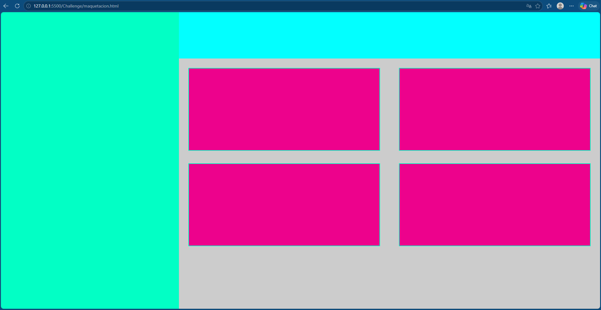
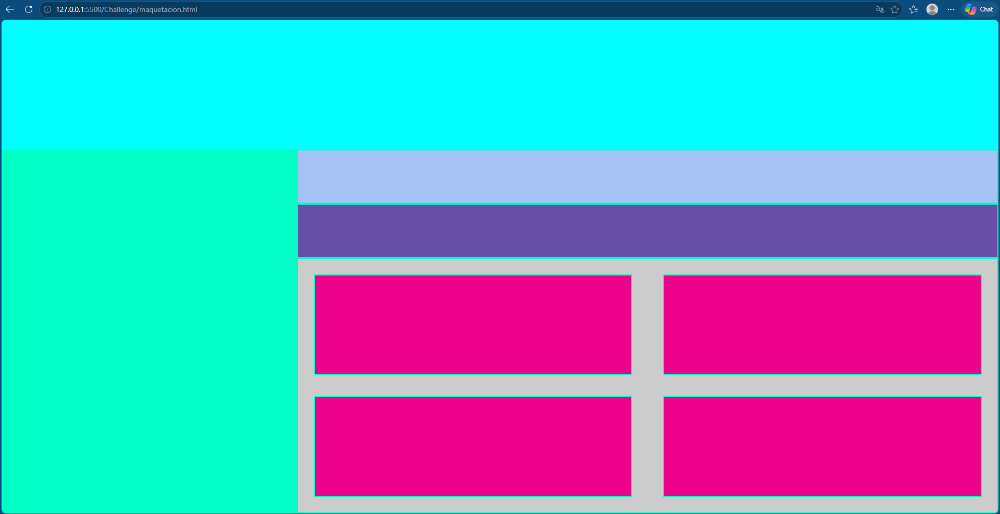

# Intento 3

En el intento 3 lo que use para este reto fue:

- https://www.joshwcomeau.com/css/interactive-guide-to-flexbox/
- https://css-tricks.com/snippets/css/a-guide-to-flexbox/

Y una vez tenía una pequeña base, le pregunté a la ia (copilot) seleccionando los 4 rectangles dentro de main:

> como hago para que se divida en 2 arriba y 2 abajo

Pero sin lograr entender mucho la verdad

## Intento 3:



Después de ver mi falta de conocimientos en el intento 1 y 2, decidí iniciar un nuevo curso viendo todos los conceptos básicos desde como llamar un elemento hasta flex y grid de forma avanzada, la evidencia de esto se encuentra dentro de la carpeta course.

Una vez terminé las clases hasta grid y flex avanzado, intenté nuevamente desarrollar el challenge y esta vez lo pude terminar mucho mejor, pude hacerlo sin IA o google, pero me quedaron algunas dudas y eso si utilicé IA para ayudarme, las preguntas fueron:

1. Chat, cuál es la diferencia entre usar:

```css
display: grid;
grid-template-columns: repeat(2, minmax(0, 1fr));
```

y display: grid;

```css
grid-template-columns: repeat(2, 1fr);
```

?

y para que no sirve especificar el tamaño de la columna en el repeat si pongamos el numero que pongamos van a tener el mismo tamaño ya que son repeat?

2. en el curso que estoy viendo rem es para espaciado pero em es para padding interno de componentes, gap cuál debería de usar?

Para entender mejor ciertos conceptos y tener mejor prácticas a la hora de programar.

también utilicé IA para darle un poco de estilo a este readme :)

## Intento 4:



### que pasa si el diseñador nos cambia el layout? se podría cambiar con su codigo actual? o tomaria mas tiempo el refactor?

Para este reto no utilicé ni IA ni google, simplemente con la base anterior se modificó un poco, crando 2 nuevos elementos y 1 contenedor nuevo. Para mi es más eficiente modificar el código que empezar de 0 nuevamente!
