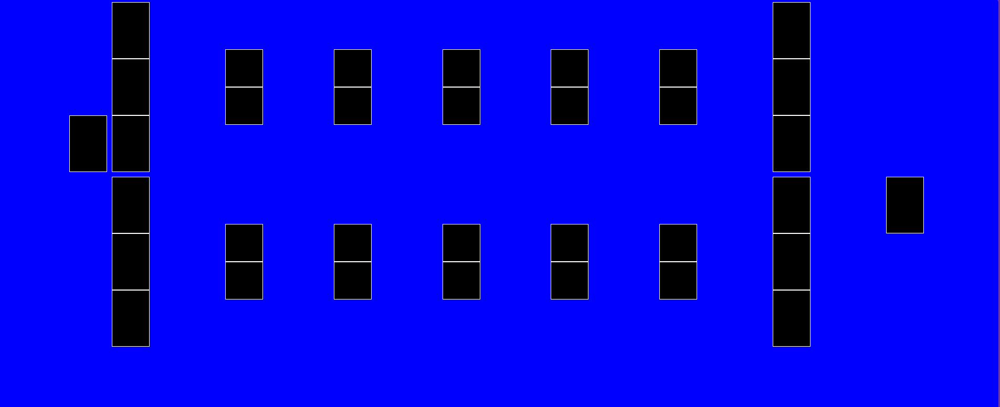

I used AI for just one question:
why does this has an scroll? i want to be screen height, no more
AI answer:

The scroll happens because `body` has `height: 100vh` **plus** `padding: 3rem`, making the total height exceed the viewport. Adding `box-sizing: border-box` makes the padding count _inside_ the 100vh instead of on top of it.

```

```

`box-sizing: border-box` tells the browser to include `padding` and `border` within the declared `height: 100vh`, so nothing overflows.

Made changes.

basically I was missing box-sizing

---

For the board challenge in my first try I thought I had it


But then when I closed the dev tools,reality hit me like a truck


